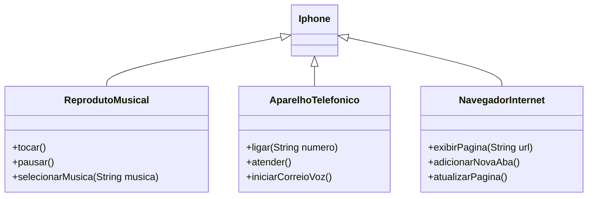

# Conta Bancária

Desenhando arquitetura de um Iphone via UML

### Conhecimentos adquiridos:

- Padrão UML

### Resultado do Desafio 

## Desafio
 [Link do Desafio](https://github.com/digitalinnovationone/trilha-java-basico/tree/main/desafios/poo)
